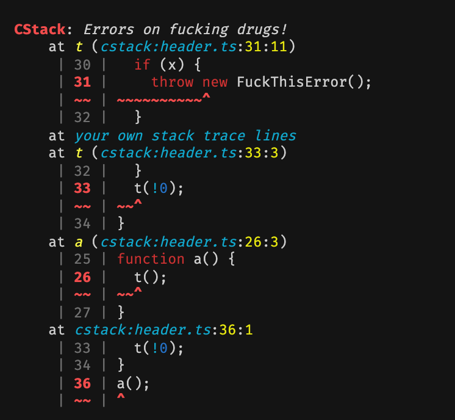

# Custom Stack



This [deno](https://deno.land) module allows you to create the coolest looking
errors, and customize the error stack trace as you wish. Given the opportunity cstack will also load your file content, highlight it, and pinpoint exactly where your errors are thrown.

Now you never have to be wondering "why the fuck doesn't this work?" ever again! With a 100% guarantee you'll receive less [WTFs](https://www.gridshore.nl/2008/03/29/how-wtfs-improve-code-quality-awareness/) a minute using this tool. We got you covered!

## Usage for lazy people

If you're one of those people who's just interested in getting these fucking awesome looking errors in your application, all you have to do is import the Error replacement script.

```ts
import "https://deno.land/x/cstack/errors.ts";
```

Now before you go try this out and an error is spat at your face not looking as fancy as you expected, there is a known unfixable issue. CStack cannot replace errors thrown by V8 or the Deno core, but, we've implemented a short fix for you. All you have to do it catch the error and rethrow it using one of cstack's functions:

```ts
import { fix } from "https://deno.land/x/cstack/utils.ts";

try {
  somethingThatWillCauseDenoOrV8ToThrow();
} catch (error) {
  throw fix(error);
}
```

Now go have fun!

## Usage for you advanced users

More information for advanced users coming whenever I feel like it, PR is welcome.
